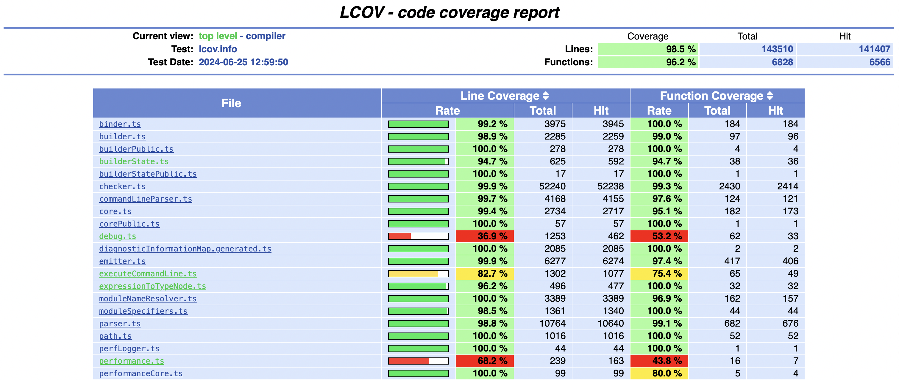
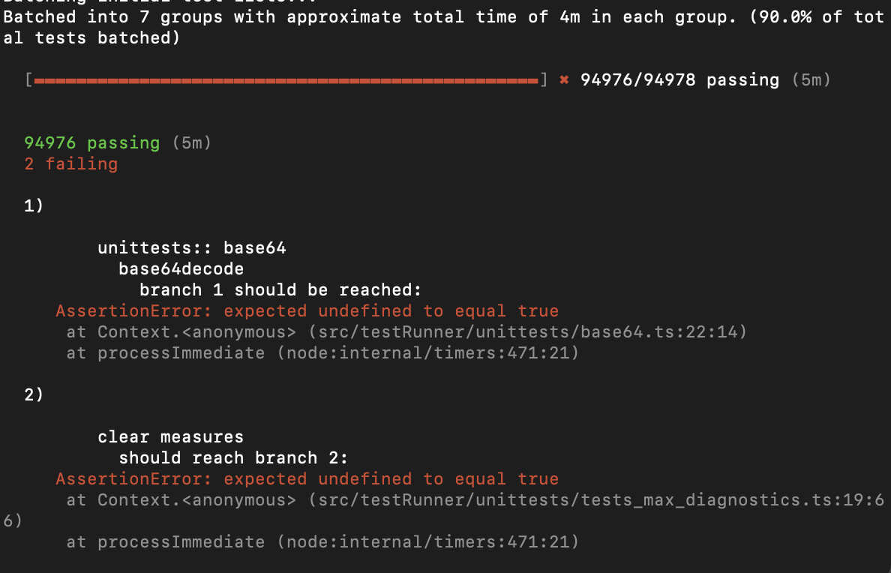
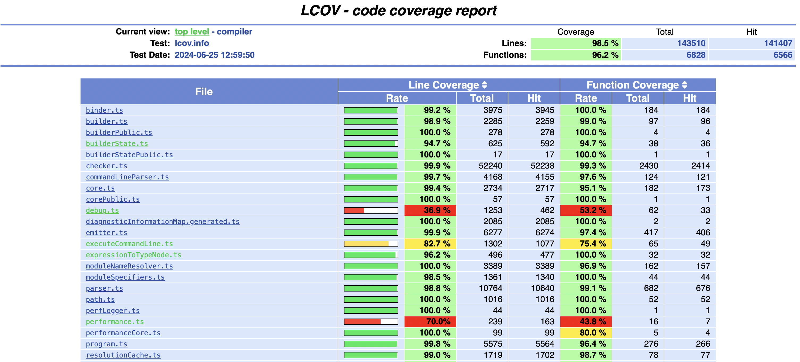

# Report for Assignment 1

## Project chosen

Name: TypeScript

URL: https://github.com/EmilioAK/TypeScript.git

Number of lines of code and the tool used to count it:  4774750 lines counted with lizard (python tool)

Programming language: TypeScript and JavaScript

## Coverage measurement

### Existing tool

<Inform the name of the existing tool that was executed and how it was executed>

Typescript already included an existing coverage checker called `c8`. It then uses `lcov` to generate a readable report that is also converted into an HTML file that can be viewed in the browser.

### Your own coverage tool

We finished our assignment before the project description was rewritten and got permission from Phillip to keep our code that tests different functions. Typescript does not allow us to print inside the files we are testing. The workaround we went with is to create our own custom branch coverage code that we added to the files, as intended, and then we create tests that execute successfully if the branches are reached as expected. This has the same effect and provides the same information as printing inside the branch coverage code would. 

<The following is supposed to be repeated for each group member>

#### Max Raulea

base64decode()

commit url: https://github.com/microsoft/TypeScript/commit/f91ae9729538be45120c40d16c18aa85d48763f9

clearMeasures()

commit url: https://github.com/microsoft/TypeScript/commit/f91ae9729538be45120c40d16c18aa85d48763f9

#### Emilio Alvarez

The tests executing successfully for me indicates that the coverage was properly checked and ran as expected.

`mark()`

Commit url: https://github.com/EmilioAK/TypeScript/commit/43aa6178b8c50de22557d291ceb2ca523749039a

`clearMarks()`

Commit url: https://github.com/EmilioAK/TypeScript/commit/43aa6178b8c50de22557d291ceb2ca523749039a

## Coverage improvement

### Individual tests

<The following is supposed to be repeated for each group member>

#### Max Raulea

GetDuration()
&
ClearMeasures()
commmit url: https://github.com/microsoft/TypeScript/commit/60cc3cb5b24eb248859e20843ba2b33e93196406
<Provide the same kind of information provided for Test 1>

The coverage improved since at first the function was not tested, my test added a test for that fucntion which means it now is tested at thus covered in the tests. Before my tests of performance.ts it had a coverage of 68.2% and after my tests this was raised to 70%.

and after adding the new tests

#### Emilio Alvarez

`enable()` inside `src/compiler/performance.ts` & `mark()` inside `src/compiler/performance.ts`. These functions were basically not covered at all, and my tests cover at least 80% of the branches.

`enable()` before my tests

`enable()` after my tests

`mark()` before my tests

`mark()` after my tests

### Overall

<Provide a screenshot of the new coverage results by running the existing tool using all test modifications made by the group>

## Statement of individual contributions

Max Raulea: "I wrote some new tests for the 2 functions, clearmeasures() and getduration(), then I tested the coverage of the base64decode() and clearmeasures() function. I also wrote the shared part of the report in the md file as well as my own part"

Emilio Alvarez: "I wrote new tests for `mark()` and `enable()` and I tested the coverage of `mark()` and `clearMarks()` using my custom tool. I wrote my sections of this report.
